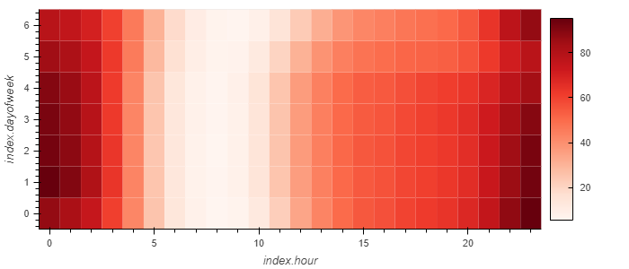

# Forecasting Performance using FBProphet
Tool designed to find out if the ability to predict search traffic can translate into the ability to successfully trade the stock.

Render jupyter notebok using NBVIEWER https://nbviewer.org/github/JeremyPVargas/forecasting_time_series_net_prophet/blob/main/forecasting_net_prophet.ipynb

# Crypto Investments - Unsupervisied Machine Learning Performance Analysis
<!-- TABLE OF CONTENTS -->

  
Table of Contents

  <ol>
    <li>
      <a href="#purpose">Purpose</a>
      <ul>
        <li><a href="#inputs">Inputs</a></li>
        <li><a href="#outputs">Outputs</a></li>
      </ul>
    </li>
    <li>
      <a href="#technologies">Technologies</a>
      <ul>
        <li><a href="#hvplot">hvplot</a></li>
        <li><a href="#prophet">prophet</a></li>
        <li><a href="#holoviews">holoviews</a></li>
        <li><a href="#pystan">pystan</a></li>
        <li><a href="#pandas">pandas</a></li>
        <li><a href="#matplotlib">Matplotlib</a></li>
      </ul>
    </li>
    <li><a href="#version-release">Version Release</a></li>
    <li><a href="#how-to-run">How to run</a></li>
    <li><a href="#usage">Usage</a></li>
    <li><a href="#contributors">Contributors</a></li>
    <li><a href="#license">License</a></li>
        <ul>
        <li><a href="#permissions">Permissions</a></li>
        <li><a href="#disclaimer">Disclaimer</a></li>
        </ul>
    </li>
    <li><a href="#aknowledgements">Aknowledgements</a></li>

---

<!--Purpose -->
## Purpose
This tool is designed to conuct Time Series Analysis on data which will be used to understand correlations between stock close prices and searches on the company performed in Google, also this data is used to forecast performance based on patterns established accross data sets. 

### Inputs
The application reads MercadoLibre's performance data along with data from google searches on the company.

    google_hourly_search_trends.csv
    mercado_daily_revenue.csv
    mercado_stock_price.csv

  
### Outputs
    1. Finds unusual patterns in hourly Google search traffic
    2. Mines the search traffic data for seasonality
    3. Relates the search trafic to stock price patterns
    4. Creates a time series model with Prophet
    5. Forecasts revenu using time series models
    
    

    
---
<!--Technologies -->
## Technologies
### Python:

    Phyton Version: **3.7.13**

## Libraries and Dependencies

### hvplot
[hvplot](https://holoviz.org/tutorial/Composing_Plots.html)

### phrophet
[phrophet](https://pypi.org/project/fbprophet/)

### holoviews
[holoviews](https://holoviews.org/) 

### pystan
[pystan](https://pystan.readthedocs.io/en/latest/)

### pandas
[pandas](https://pandas.pydata.org/)

### matplotlib
[matplotlib](https://matplotlib.org/)

---
<!--How to run -->
## How to run
1. Clone the repository on a folder that will easy to open
2. File can run on a Jupyter notebook or Google Colab
3. Open the file with Jupiter using the Anaconda Navigator
4. Navigate open the folder where the files were cloned to
5. Open the file on JupyterLab
6. Make sure to import and install the required libaries and dependencies: 

        # Install the required libraries
            !pip install prophet
            !pip install hvplot
            !pip install holoviews
            !pip install pystan

        #Import the required libraries and dependencies
            import pandas as pd
            from pathlib import Path
            import holoviews as hv
            from prophet import Prophet
            import hvplot.pandas
            import datetime as dt
            %matplotlib inline
            from google.colab import files

ANACONDA - Navigator

GOOGLE - Colab

---
<!--Version Release -->
## Version Release

### Version 1.0

---
<!--Usage -->
## Usage

### Visualization: Google search trends during May 20202

### Visualization: Google search trends half of the year

### Visualization: Heatmap searches by day and hour

### Visualization Stock close over years:

### Visualization Stock close trends half year:

### Visualization : Plot trends components:

### Visualization : Trends plot Forecast with Prophet:

### Forecast Data:

---
<!--Contributors -->
## Contributors

Jeremy Vargas

    Managing Director
    Resonant Solutions LLC
    email:    jeremyvargas@resonantsolutions.org
    linkedin: https://www.linkedin.com/in/jeremyvargas/

UW FinTech Bootcamp
- Startup code provided by institution

---
<!--License -->
## License
Tool is available under an MIT License.

Copyright (c) 2022 - Resonant Solutions, LLC

### Permissions
Permission is hereby granted, free of charge, to any person obtaining a copy of this software and associated documentation files (the “Software”), to deal in the Software without restriction, including without limitation the rights to use, copy, modify, merge, publish, distribute, sublicense, and/or sell copies of the Software, and to permit persons to whom the Software is furnished to do so, subject to the following conditions:

The above copyright notice and this permission notice shall be included in all copies or substantial portions of the Software.
### Disclaimer
The Software is provided “as is”, without warranty of any kind, express or implied, including but not limited to the warranties of merchantability, fitness for a particular purpose and noninfringement. In no event shall the authors or copyright holders be liable for any claim, damages or other liability, whether in an action of contract, tort or otherwise, arising from, out of or in connection with the software or the use or other dealings in the Software.

---
<!--Aknowledgements -->
## Aknowledgements
* [Markdown Guide](https://www.markdownguide.org/basic-syntax/#reference-style-links)

<!-- MARKDOWN LINKS & IMAGES -->
<!-- https://www.markdownguide.org/basic-syntax/#reference-style-links -->